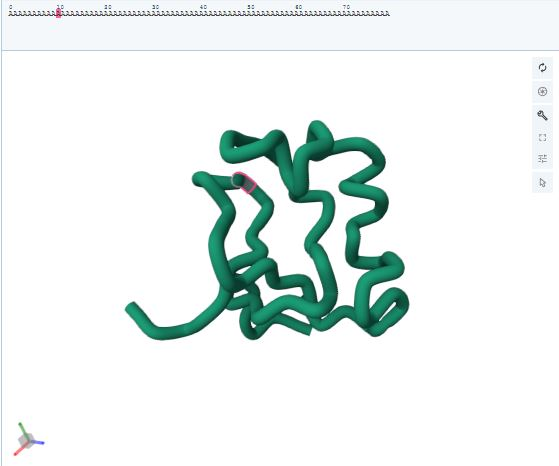

# Protein-Structure-Analysis-with-Generative-Models

Implementation of recent papers on protein structure analysis and generation using generative models. The content contains:

1. **DiffLinker**: A model designed to predict the linking atoms between two fragments of a molecule. First, the size of the linker (number of atoms connecting fragments) is calculated using a GNN. Then, the linking atoms are randomly sampled (just like random noise in Diffusion Models) and denoised. The output is a .xyz file containing the number of atoms, their types, and positions.

Sample Output:

| Original Fragments | Reconstructed Molecule |
| --- | --- |
|  |  |

2. **ProtDiff-SMCDiff**: A combination of two models for generating the scaffold of a protein. First, Protein Diffusion (ProtDiff) generates a protein backbone in 3D. Then, Sequential Monte-Carlo Diffusion (SMCDiff) generates the scaffold conditioned on the generated protein's motif ($p_{theta}(x_S | x_M)$). The output is .pdb file containing atoms' types, positions, and other information.

Sample Output: 

3. **GNN Assignments**: Assignments from Stanford course **Machine Learning with Graphs** regarding edge classification (probability of the existence of an edge) based on node embeddings, node and graph property prediction.
